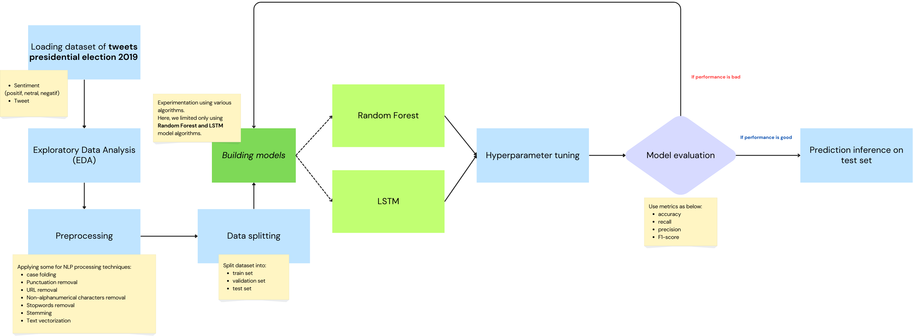
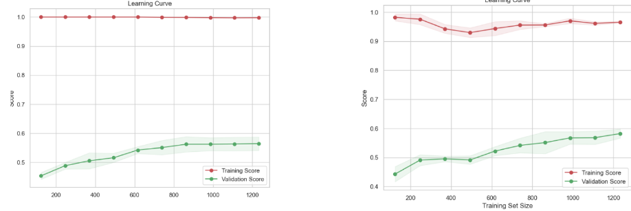

# sentiment-analysis-tweets

## 1. Introduction
The Sentiment Analysis project aims to develop an intelligent system based on AI technology to classify sentiments on Twitter using the text analysis method. This system will help obtain positive, negative or neutral opinion sentiment trends from users on the platform.

As for the algorithms, using **Random Forest** and **LSTM**.

## 2. Dataset
The dataset used is a collection of tweets from Twitter users during the 2019 Presidential Election. The dataset was obtained through a web scraping process. The data consists of 1815 tweets that contain three categories of sentiment: positive, neutral and negative.

## 3. Objectives
- Get an overview of public opinion regarding the upcoming 2019 Presidential Election
- Measuring the popularity of presidential election candidates based on public opinion

## 4. Requirements
- The project use python 3.12 (but it might be ok to use other version between 3.8 and 3.12)
- Whereas for the required python libraries, please kindly check the [requirements.txt](./requirements.txt)

## 5. Project Flow

- Exploratory Data Analysis (EDA)
- Text pre-processing
    - Case folding
    - Punctuation removal
    - URL removal
    - Non-alphanumerical characters removal
    - Stopword removal
    - Stemming
    - Text Vectorization
- Split into Train, Validation, and Test set
- Develop Random Forest models
    - Hyperparameter Tuning
    - model evaluation
    - predict on test set
- Develop LSTM models
    - Hyperparameter Tuning
    - model evaluation
    - predict on test set

## 6. Output

By using Random Forest model the result is quite good by accuracy about 60%.

In the above image, left panel is learning curve of baseline Random Forest Model with red line curve is performance on train set while green line curve on validation set.
While the right panel is Random Forest after implemented the hyperparameter tuning. It can be seen that after being tuned, the performance is slighly improved by reducing the overfitting.
